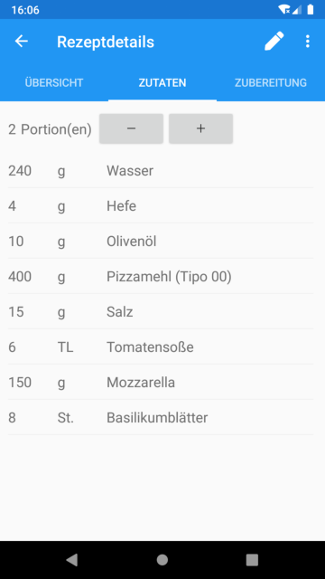

# RecipeApp

A Xamarin.Forms recipe app (currently only for Android) that uses Entity Framework Core to access an SQLite database.

[](https://github.com/hocnat/RecipeApp/blob/master/LICENSE)

## Motivation

The idea of this project was to experiment with Xamarin.Forms. At the same time it was a good opportunity to get to know Entity Framework Core better.

## Features

### Add all your favourite recipes


### Search for a specific recipe in your list of recipes


### View recipe details and let the app calculate ingredients for different numbers of servings





### Edit your recipes


### Delete recipes


### Backup and restore your recipes


### Use in English or German (depending on your devices settings)


## Try it yourself

### Clone

Open a command line.

```shell
git clone https://github.com/hocnat/RecipeApp.git
```

### Build

Open Solution in Visual Studio.

Right click on solution | Rebuild Solution

### Deploy

> Make sure the Android Emulator is [configured](https://docs.microsoft.com/en-us/xamarin/android/get-started/installation/android-emulator/) correctly or connect an Android device.

Right click on RecipeApp.Android | Set as Startup Project

Right click on solution | Deploy Solution

### Run

Open app `Recipes`.

### Build .apk file

Set Configuration to `Release` | Right click on solution | Archive All...

### Sign .apk file

Wait until Archive Manager finished building .apk file.

Distribute ... | Ad hoc | Choose existing or create new Signing Identity | Save As

### Copy and install

Connect device via USB | Copy signed .apk file (e.g. to Download folder) | Click on .apk file | Install

> If necessary, allow installation from unknown sources.

## Built with

* [Xamarin.Forms](https://www.nuget.org/packages/Xamarin.Forms/5.0.0.2012) - Microsoft - [MIT License](https://licenses.nuget.org/MIT)
* [Microsoft.EntityFrameworkCore.Sqlite](https://www.nuget.org/packages/Microsoft.EntityFrameworkCore.Sqlite/5.0.7) - Microsoft - [Apache-2.0 License](https://licenses.nuget.org/Apache-2.0)
* [Xam.Media.Plugin](https://www.nuget.org/packages/Xam.Plugin.Media/5.0.1) - James Montemagno - [MIT License](https://github.com/jamesmontemagno/MediaPlugin/blob/master/LICENSE)
* [Font Awesome](https://fontawesome.com/) - Font Awesome - [SIL OFL 1.1 License](https://scripts.sil.org/cms/scripts/page.php?site_id=nrsi&id=OFL)

## License

[MIT License](https://github.com/hocnat/RecipeApp/blob/master/LICENSE) Copyright 2020 © [hocnat](https://github.com/hocnat)
